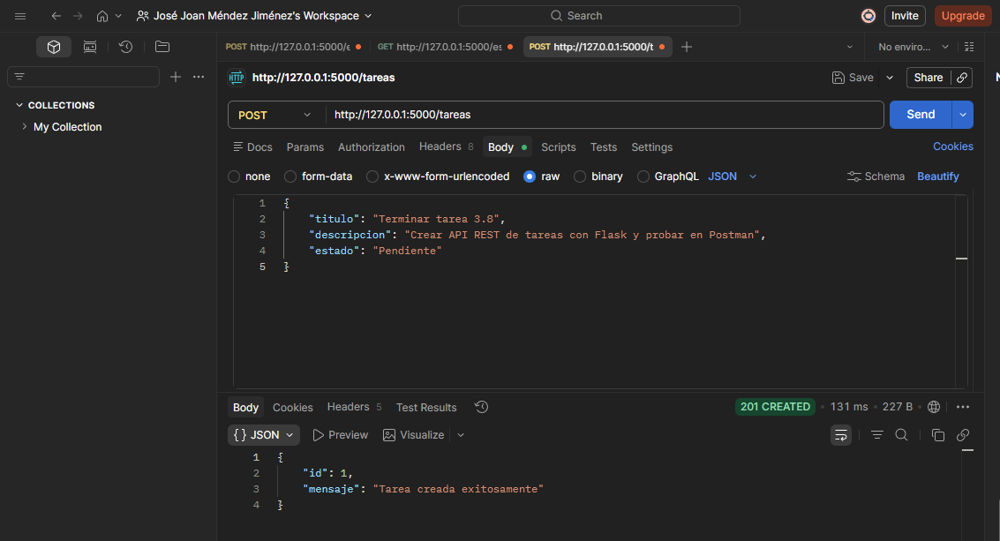
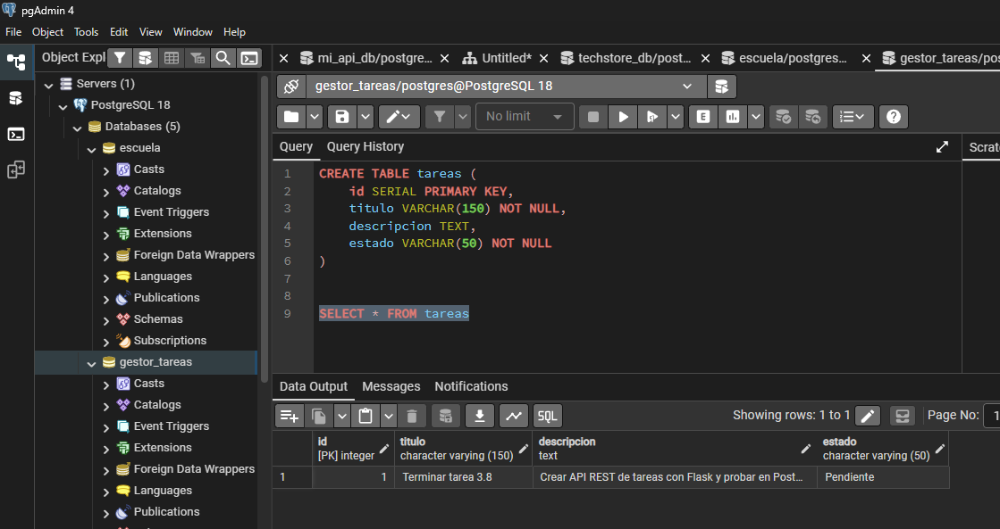
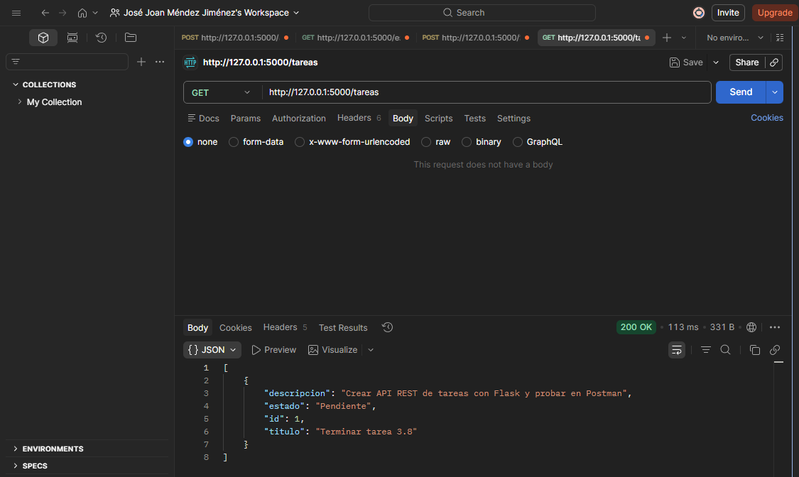
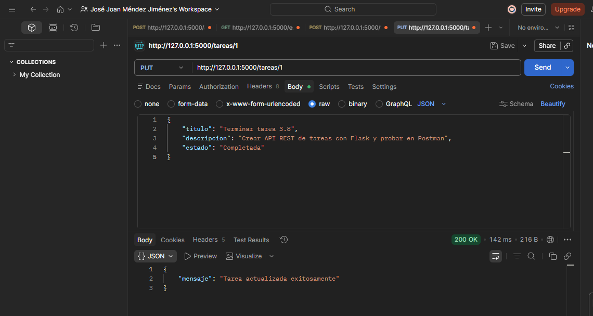
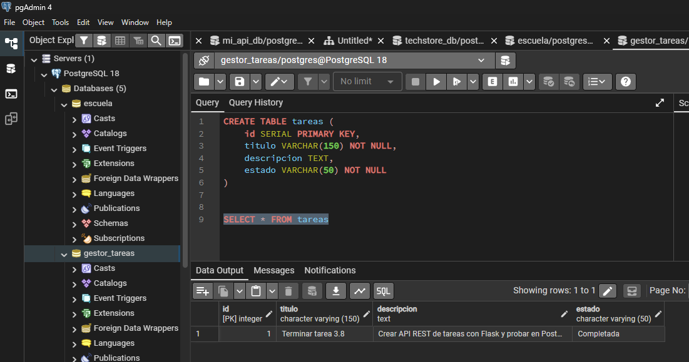
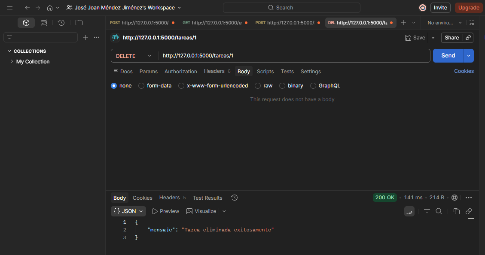
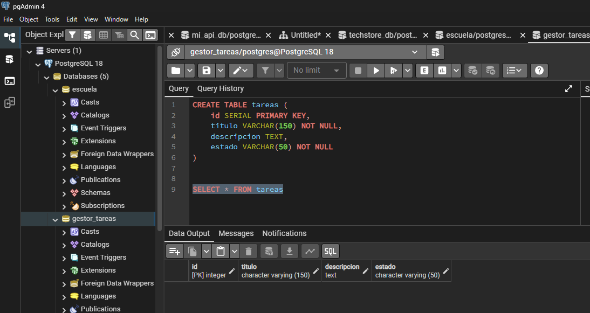

# Tarea 3.8: API Gestion de Tareas

## Tecnologías Utilizadas
* Python
* Flask
* PostgreSQL (pgAdmin 4)
* Postman (para pruebas de los endpoints)

## Evidencias de Funcionamiento

**Evidencia 1 (POST):**

**Evidencia 2:**

**Evidencia 3 (GET):**

**Evidencia 4 (PUT):**

**Evidencia 5:**

**Evidencia 6 (DELETE):**

**Evidencia 7:**

